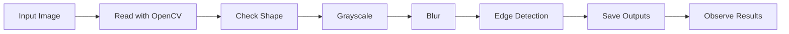

# Day 1 - Image I/O and Basic Preprocessing

## 1. 실험 목적

TODO:
- 오늘 실험의 목적을 내 말로 작성한다.
- 이미지 입력/출력과 전처리가 왜 모든 영상처리 프로젝트의 시작인지 작성한다.

오늘 실험의 목적은 이미지를 어떻게 입출력 시키고 이미지의 전처리 스케일 변환,블러,엣지검출등이 어떻게 이루어지고 무엇이 중요한지 알아보는 것이다.
영상은 이미지의 집합이며 결국 이미지를 어떻게 처리하는가에 달려있다. 본질은 이미지고 이 이미지를 어떻게 처리하여 원하는 결과를 얻는가가 중요하다.
---

## 2. 실험 흐름



TODO:
- 위 흐름을 보고 각 단계가 무슨 역할인지 한 문장씩 작성한다.

1.먼저 경로의 토대인 프로젝트 경로를 만든다.
2.준비한 이미지의 경로를 만든다.
3.결과물이 저장될 경로를 만든다.
4.저장될 경로가 없다면 자동으로 만들도록 한다.
5.준비한 이미지의 파일이 있는지 검사한다.
6.cv를 이용해 이미지를 받아들인다 이때 이미지는 배열형태로 들어간다.
7.제대로 받아들였는지 확인한다.
8.받아들인 이미지의 크기를 출력한다.
9.원본 이미지를 그레이 스케일로 전환시킨다.
10.노이즈를 제거하기위해 전환시킨 이미지에 가우시안 블러를 추가한다.
11.캐니 엣지 기법을 사용해 엣지를 검출시킨다.
12.결과물을 저장하기위해 cv를 이용한다.
13.정상적으로 저장되었으면 로그를 띄운다.
---


## 3. 실행 방법

TODO:
아래 명령어가 왜 리포 최상위에서 실행되어야 하는지 작성한다.

```bash
python labs/week01_opencv_basics/day01_image_io_preprocessing/src/main.py
```
리포 최상위에서는 하위 파일들에 접근할 수 있기 때문이다.
---

## 4. 결과 파일

TODO:
실행 후 생성된 파일을 확인하고 체크한다.

- [o] outputs/images/grayscale.png
- [o] outputs/images/blur.png
- [o] outputs/images/edges.png

---


