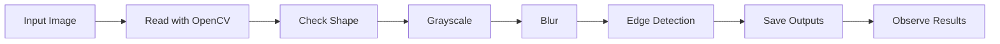

# Day 1 - Image I/O and Basic Preprocessing

## 1. 실험 목적

TODO:
- 오늘 실험의 목적을 내 말로 작성한다.
- 이미지 입력/출력과 전처리가 왜 모든 영상처리 프로젝트의 시작인지 작성한다.

---

## 2. 실험 흐름



TODO:
- 위 흐름을 보고 각 단계가 무슨 역할인지 한 문장씩 작성한다.

---

## 3. 사용한 이미지

TODO:
- 파일명:
- 이미지 내용:
- 이미지 선택 이유:
- 물체와 배경이 어떻게 구분되는지:

---

## 4. 실행 방법

TODO:
아래 명령어가 왜 리포 최상위에서 실행되어야 하는지 작성한다.

```bash
python labs/week01_opencv_basics/day01_image_io_preprocessing/src/main.py
```

---

## 5. 결과 파일

TODO:
실행 후 생성된 파일을 확인하고 체크한다.

- [ ] outputs/images/grayscale.png
- [ ] outputs/images/blur.png
- [ ] outputs/images/edges.png

---

## 6. 결과 요약

TODO:
직접 결과를 보고 작성한다.

| Result | Observation |
|---|---|
| Grayscale | TODO |
| Blur | TODO |
| Edge | TODO |

---

## 7. 실패/한계

TODO:
- 예상과 다르게 나온 부분:
- 원인 추정:
- 다음에 바꿔볼 값 또는 방법:

---

## 8. 면접에서 설명할 수 있는 문장

TODO:
오늘 한 작업을 3~5문장으로 작성한다.
