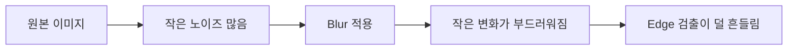

# Day 1 Concept Guide

## 1. 오늘의 큰 그림

영상처리 프로젝트는 보통 아래 순서로 시작한다.


오늘은 AI 모델을 만들지 않는다.  
먼저 컴퓨터가 이미지를 어떻게 읽고, 어떻게 바꾸고, 어떻게 저장하는지를 배운다.

---

## 2. 이미지란 무엇인가?

사람에게 이미지는 사진이다.  
하지만 컴퓨터에게 이미지는 숫자의 표다.

흑백 이미지는 이렇게 생각할 수 있다.

```text
0   = 완전 검정
255 = 완전 흰색
```

예를 들어 작은 흑백 이미지는 아래처럼 숫자 표로 표현될 수 있다.

```text
[
  [  0,  30,  80, 120],
  [ 20,  60, 140, 200],
  [ 40, 100, 180, 230],
  [ 90, 150, 220, 255]
]
```

표 안의 숫자 하나가 픽셀이다.

---

## 3. 픽셀이란 무엇인가?

픽셀은 이미지를 이루는 가장 작은 점이다.

이미지 크기가 `1280 x 720`이라면 의미는 다음과 같다.

```text
가로 방향 픽셀 1280개
세로 방향 픽셀 720개
```

전체 픽셀 수는 `1280 × 720 = 921,600개`다.

컴퓨터비전은 결국 이 수많은 픽셀 숫자를 보고 판단하는 기술이다.

---

## 4. 컬러 이미지와 채널

흑백 이미지는 픽셀 하나에 밝기 숫자 하나만 있으면 된다.

컬러 이미지는 색을 표현해야 하므로 보통 숫자 3개가 필요하다.

```text
R = Red
G = Green
B = Blue
```

다만 OpenCV는 기본적으로 RGB가 아니라 BGR 순서로 이미지를 읽는다.

```text
일반 설명: RGB
OpenCV 기본: BGR
```

OpenCV에서 읽은 컬러 이미지의 픽셀 하나는 보통 아래처럼 이해하면 된다.

```text
[B, G, R]
```

---

## 5. image.shape

OpenCV로 이미지를 읽고 `image.shape`를 출력하면 보통 이런 값이 나온다.

```text
(720, 1280, 3)
```

의미는 다음과 같다.

| 위치 | 의미 |
|---|---|
| 720 | 높이, 세로 픽셀 수 |
| 1280 | 너비, 가로 픽셀 수 |
| 3 | 채널 수 |

주의할 점은 순서다.

사람은 보통 `가로 x 세로`라고 말하지만, 배열에서는 보통 `세로, 가로, 채널` 순서로 나온다.

---

## 6. Grayscale

Grayscale은 컬러 이미지를 흑백 이미지로 바꾸는 것이다.

컬러 이미지는 픽셀 하나가 숫자 3개를 가진다.

```text
[B, G, R]
```

Grayscale은 이를 밝기 숫자 하나로 줄인다.

```text
밝기 값 1개
```

장점:

| 장점 | 설명 |
|---|---|
| 계산 단순 | 채널 3개를 1개로 줄이므로 계산량이 줄어든다 |
| 밝기 차이 집중 | 형태, 경계, 명암을 보기 쉬워진다 |
| 기본 전처리로 적합 | edge, threshold 같은 기법의 입력으로 자주 사용된다 |

단점:

| 단점 | 설명 |
|---|---|
| 색 정보 손실 | 색으로만 구분되는 물체는 구분이 어려워질 수 있다 |
| 문제에 따라 부적합 | 색상 검사가 중요한 경우에는 손해가 될 수 있다 |

---

## 7. Blur

Blur는 이미지를 부드럽게 만드는 처리다.

영상처리에서 Blur는 보통 작은 노이즈를 줄이기 위해 사용한다.



하지만 Blur는 노이즈만 골라서 없애는 마법이 아니다.  
중요한 경계도 함께 흐려질 수 있다.

| Blur 강도 | 장점 | 단점 |
|---|---|---|
| 약함 | 디테일 보존 | 노이즈가 많이 남음 |
| 강함 | 노이즈 감소 | 중요한 얇은 경계도 사라질 수 있음 |

---

## 8. Edge

Edge는 밝기가 급격히 바뀌는 부분이다.

사람은 컵과 책상을 이해하지만, 컴퓨터는 컵을 모른다.  
컴퓨터가 볼 수 있는 것은 숫자 변화다.

Edge 검출은 아래 질문을 한다.

```text
밝기 숫자가 갑자기 크게 바뀌는 위치가 어디인가?
```

Canny Edge는 대표적인 edge 검출 방법이다.

중요한 한계:

```text
Canny Edge는 물체를 이해하지 않는다.
밝기 변화만 본다.
```

그래서 배경 무늬, 그림자, 반사도 edge로 검출될 수 있다.

| 상황 | 결과 |
|---|---|
| 진짜 경계가 잘 잡힘 | 정상 검출 |
| 배경 무늬가 경계로 잡힘 | 오탐 |
| 진짜 경계가 약해서 안 잡힘 | 미탐 |

---

## 9. 오늘 실험에서 반드시 봐야 하는 것

결과 이미지를 만들고 끝내면 안 된다.

아래를 관찰해야 한다.

1. Grayscale에서 물체와 배경이 밝기로 구분되는가?
2. Blur 후 작은 노이즈가 줄었는가?
3. Blur 때문에 중요한 경계도 흐려졌는가?
4. Edge에서 진짜 물체 경계가 잘 잡혔는가?
5. Edge에서 배경, 그림자, 무늬가 오탐으로 잡혔는가?
