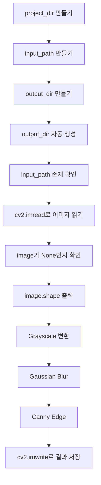

# Day 1 Implementation Guide

## 1. 구현 순서

main.py는 아래 순서로 채운다.



---

## 2. 직접 채우는 이유

완성 코드를 복사하면 실행은 빠르지만, 면접에서 설명하기 어렵다.

오늘은 아래 질문에 답할 수 있어야 한다.

- 경로를 왜 직접 만든가?
- 이미지 파일이 없으면 왜 에러를 내야 하는가?
- `cv2.imread`가 실패하면 왜 `None`이 나오는가?
- Grayscale을 왜 먼저 하는가?
- Blur를 왜 Edge 전에 하는가?
- 결과 이미지를 왜 저장하는가?

---

## 3. 막히면 질문할 단위

막히면 전체 코드를 보내지 말고 아래처럼 질문한다.

```text
TODO 6에서 cv2.imread가 왜 str(input_path)를 받아야 하는지 모르겠다.
```

또는

```text
project_dir = Path(__file__).resolve().parent.parent 이게 왜 day01 폴더인지 모르겠다.
```
