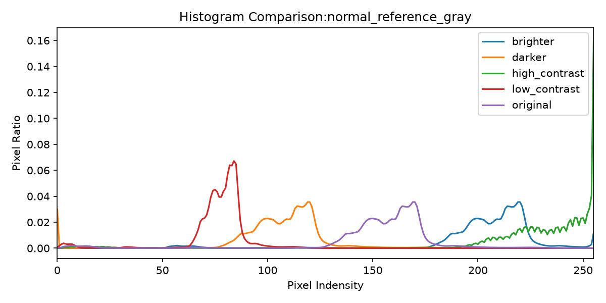
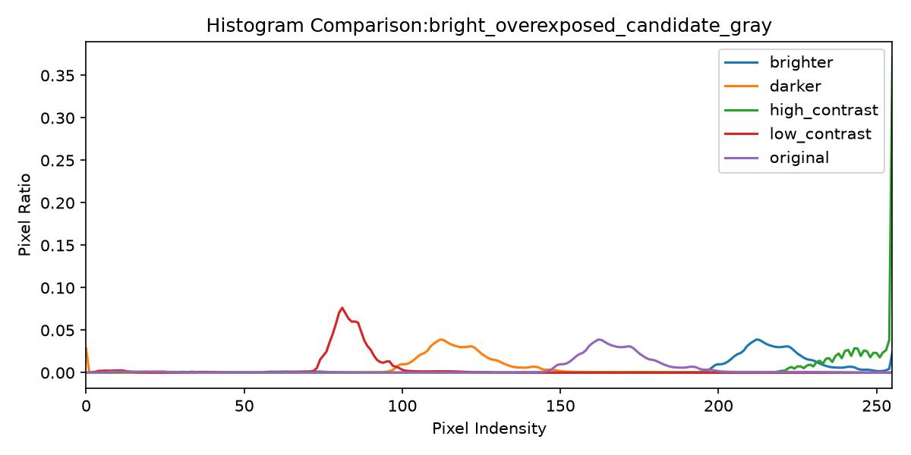
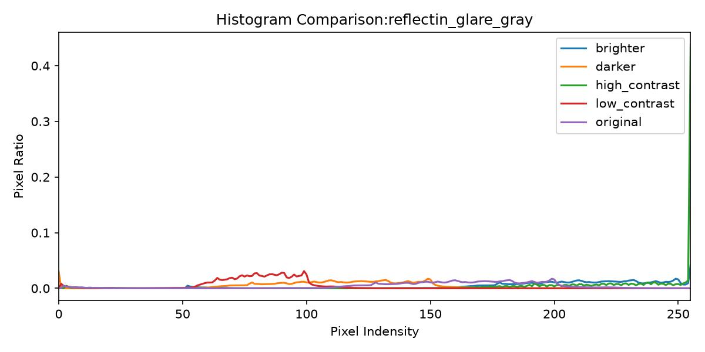
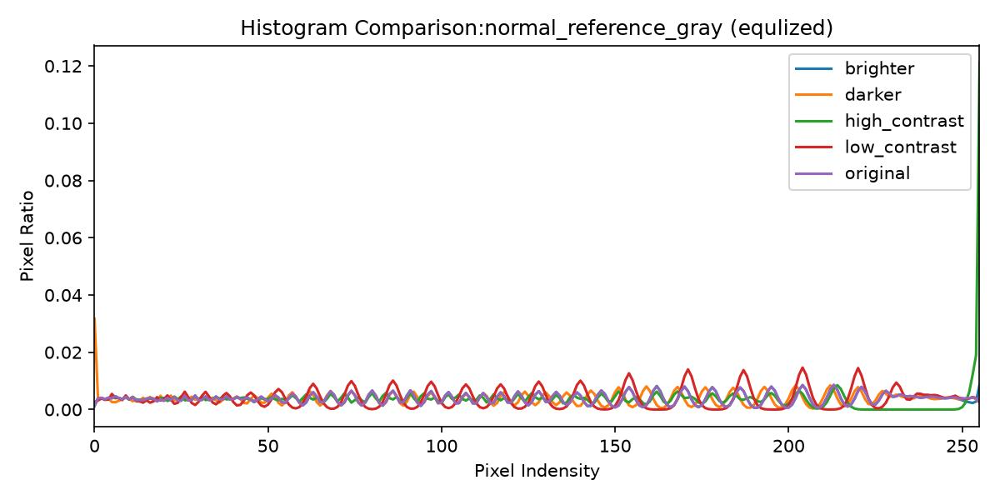

# Day 02 Log

## 1. 사용한 입력 이미지

- 파일명:bright,dark,low,normal,relectin 같은 구도의 사진을 환경을 다르게 찍었다.
- 촬영 대상: 배경무늬와 비슷한 흰 물체,100,500동전,검은 물체
- 조명 조건:밝은 상황을 기본 사진으로 두고, 어두운 경우, 대조가 어려운 경우, 너무 밝은 경우,대조가 강한경우, 반사가 생기는 경우등으로 나눴다.
- 반사 여부: 반사가 생기는 경우가 있다.
- 블러 여부:진행하지 않음
- 노이즈 여부:저대비를 관찰하기 위해 기본 배경은 깔끔한 흰배경을 사용했으나 광원과, 그림자가 발생하였다.

## 2. 원본 관찰

흰 물체는 자칫 배경무늬와 구분이 안되어 보일 수 있어보이고, 검은 물체는 반대로 명확하다. 금속물질인 동전은 조명에 민감하게 반응하며 높이가 있는 흰물체는 그림자가 발생해 흰 배경무늬에 취약해 보인다.

## 3. 밝기 실험 기록

| beta 값 | 결과 관찰 | 좋은 점 | 문제점 |
|---:|---|---|---|
| -50 | 사진이 전체적으로 어두워진다 막이 씌워진것 처럼 | 너무 밝게 찍힌 사진을 어둡게 만드는데 용이하다 | 대조의 영역에서는 별 효과가 없다. |
| 0 | 기본적인 사진이다 | 찍은 구도대로 물체가 보인다. | 대조 문제나 반사문제 그림자 문제가 보인다. |
| 50 | 사진이 전체적으로 밝아진다. | 어두웠던 사진의 물체가 더 잘보인다 |  원래 밝았던 경우 255이상으로 올라가 포화되는 현상을 보이며 대조의 영역에서는 별 효과가 없다.  |

## 4. 대비 실험 기록

| alpha 값 | 결과 관찰 | 좋은 점 | 문제점 |
|---:|---|---|---|
| 0.7 | 어두운 부분은 적게 줄어들고 밝은 부분은 많이 줄어든다  | 과대비로 인해 형태나 경계가 안보였던 문제를 해결해준다. | 대비가 원래 적었던 사진의 경우 특히 흰물체는 배경과 더욱 구분이 힘들어졌다. |
| 1.0 | 의도대로 찍혔다 | // | // |
| 1.5 | 반대로 어두운 부분은 적게 밝아지고 밝은 부분은 많이 밝아졌다. | 흰 물체의 경우 배경과 조금더 구분이 가능해 졌다. | 그림자 그리고 반사가 있는경우 더욱 도드라져 물체를 가린다. |

## 5. 히스토그램 관찰

- 원본 히스토그램은 어느 쪽에 몰려 있는가?
    기본적으로 왼쪽부터 오른쪽 부분까지 고르게 분포되어있고 저대비의 경우 편차가 적으며 고대비의 경우 넓게 퍼져있다.
    

- 밝기 조정 후 히스토그램은 어떻게 이동했는가?
    기존 사진보다 더 밝게 만들고 찍은 사진은 크게 다른점은 없지만 고대비의 경우 255를 넘어가는 포화현상이 더 심해졌다.
    

- 대비 조정 후 히스토그램은 어떻게 퍼졌는가?
    대비를 최대한 높아보이도록 구도를 설정하고 찍은 사진은 편차가 굉장히 늘어난 모습을 보였다.
    

- 평활화 후 히스토그램은 어떻게 달라졌는가?
    기준이 되는 사진으로 설명하면 평활화후 각 이미지의 편차가 평평하게 넓혀진 모습을보였다.
    

## 6. 실패 케이스

### 실패 케이스 1

사진을 밝게 두고 찍으려니 광원이 배경무늬에 보이는 현상이 생겼다.
이로인해 평활화나,대비조정시 더욱 두드려저 마치 하나의 물체가 생긴것처럼 보인다.

따라서 사진을 찍는경우 광원이 비춰지진 않는지 고려해야한다고 느껴졌다.

### 실패 케이스 2

마찬가지로 밝게 만들다보니 물체의 높이가 높을수록 그림자가 심하게 생겨 물체와 배경의 경계가 모호해지는 결과가 생겼다.

최대한 그림자가 생기지 않도록 수직으로 배치해야함을 인지해야한다.

