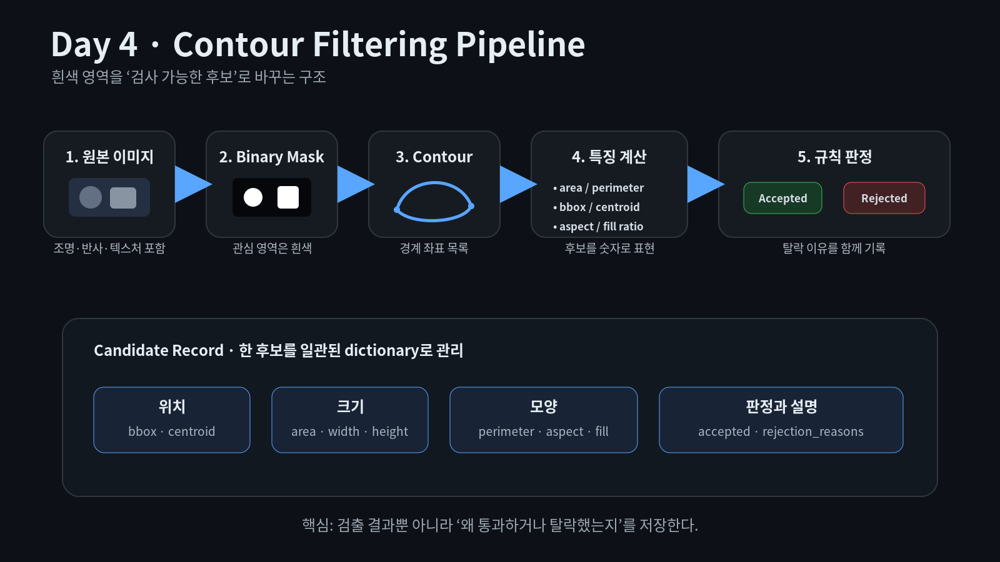
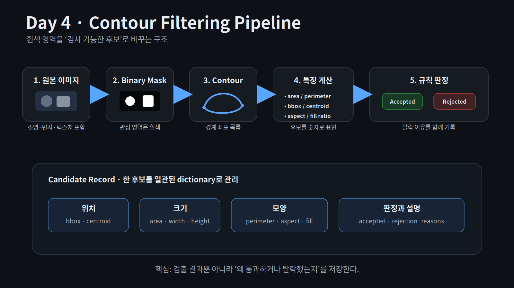
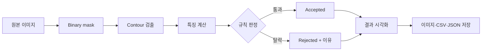

# Day 4 Infographic

## PNG



## SVG



## Mermaid 흐름도



## 핵심 데이터 구조

```text
candidate
├─ 위치: bbox, centroid
├─ 크기: area, width, height
├─ 모양: perimeter, aspect_ratio, fill_ratio
├─ 조건: touches_border
└─ 판정: accepted, rejection_reasons
```
